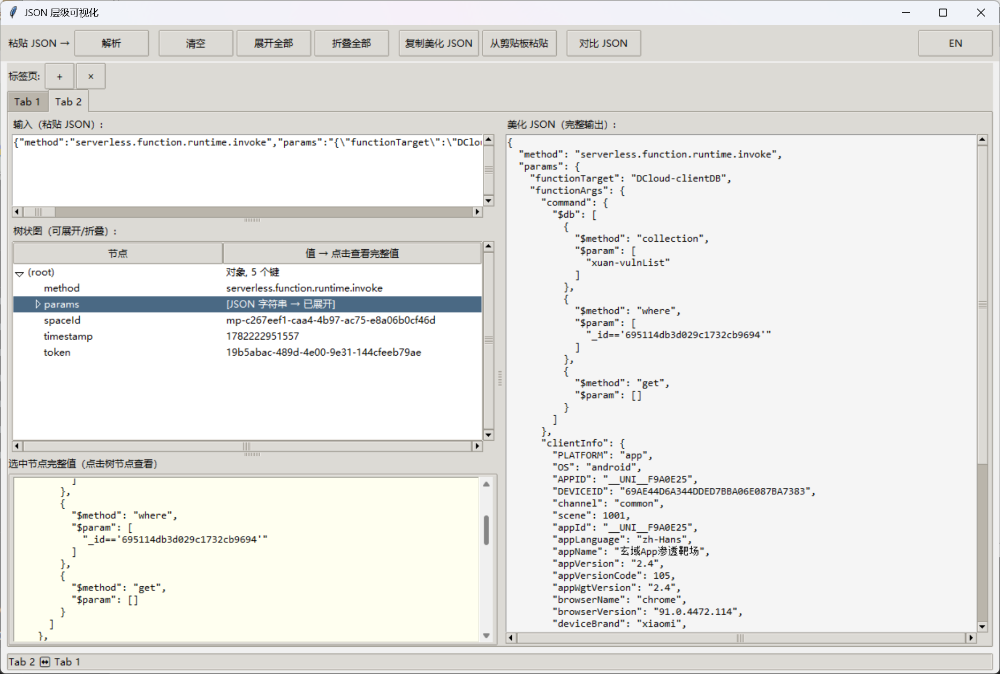
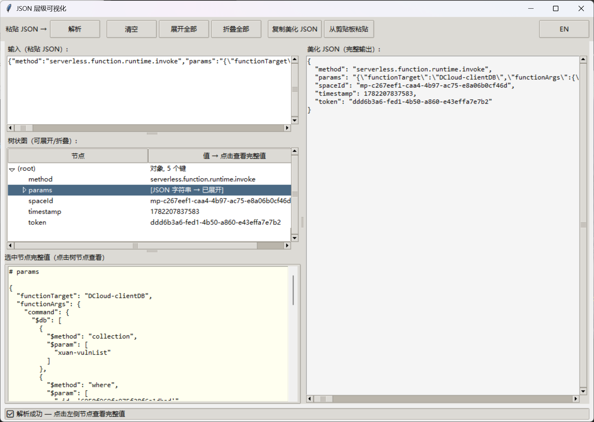

# MH-JSON — 嵌套 JSON 层级可视化工具

把嵌套复杂、层层套娃的 JSON 丢进去，自动拆解层级结构、解码 JWT、生成树状图和美化输出。

## 痛点

调试时经常遇到三层 JSON 套娃 + JWT token 的请求体：

```json
{"method":"...","params":"{\"functionTarget\":\"...\",\"functionArgs\":\"{\\\"command\\\":...}\"}"}
```

手动读根本看不清结构。这个工具一键解开。

## 功能

- ✅ 嵌套 JSON 自动逐层展开（无论套几层）
- ✅ JWT Token 自动解码并展开 Payload
- ✅ 左侧可折叠树状图（节点名 + 值列，点击查看完整值）
- ✅ 右侧美化 JSON 输出（递归展开字符串中嵌套的 JSON）
- ✅ 多标签页（同时分析多个 JSON）
- ✅ 左右并排 JSON 对比（行级差异高亮 + 同步滚动 + 手动选择对比标签）
- ✅ 一键复制美化结果
- ✅ 中英文切换
- ✅ 面板可拖拽调整大小
- ✅ 零依赖，Python 3 自带 tkinter

## 快速开始

```bash
python mh_json.py
```

1. 复制你的 JSON 数据 → 粘贴 → 点「解析」
2. 左侧树状图任意展开/折叠，右侧看美化后的完整 JSON
3. 点「复制美化 JSON」即可使用
4. 点「+」新建标签，粘贴另一个 JSON，点「对比 JSON」做左右对比

## 截图





## 依赖

**零依赖** — Python 3 自带 tkinter，无需 pip install 任何东西。

## 适用场景

- 复杂嵌套 JSON 结构分析
- JWT Token 快速解码
- API 请求/响应体拆解与对比
- 后端接口调试
- 学习 JSON 数据结构

## License

MIT
